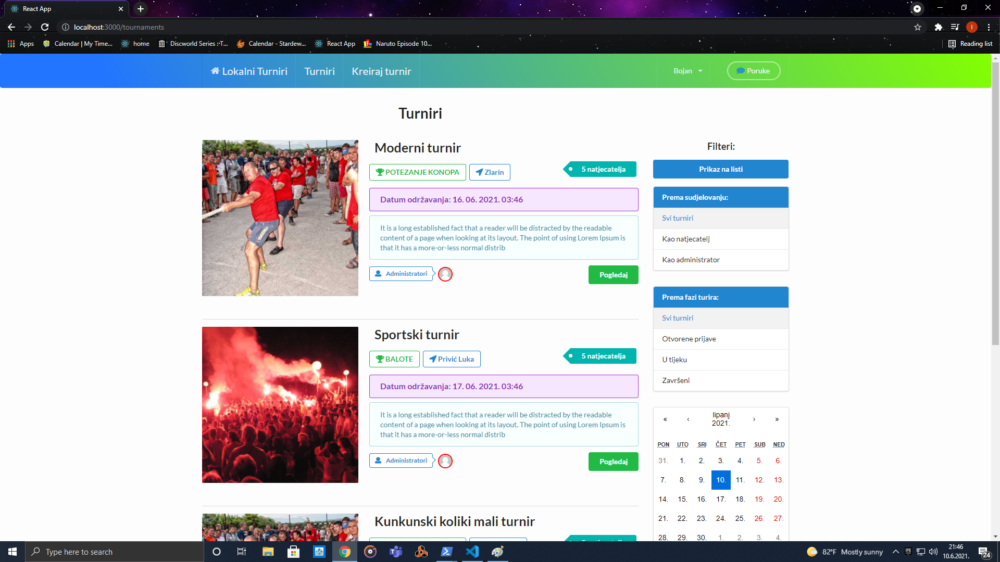
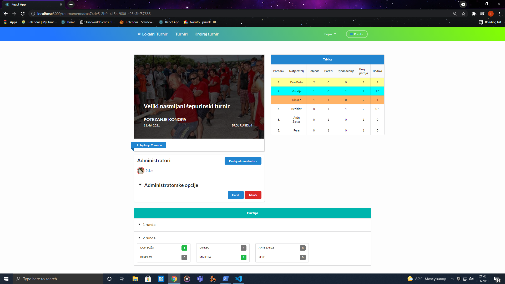
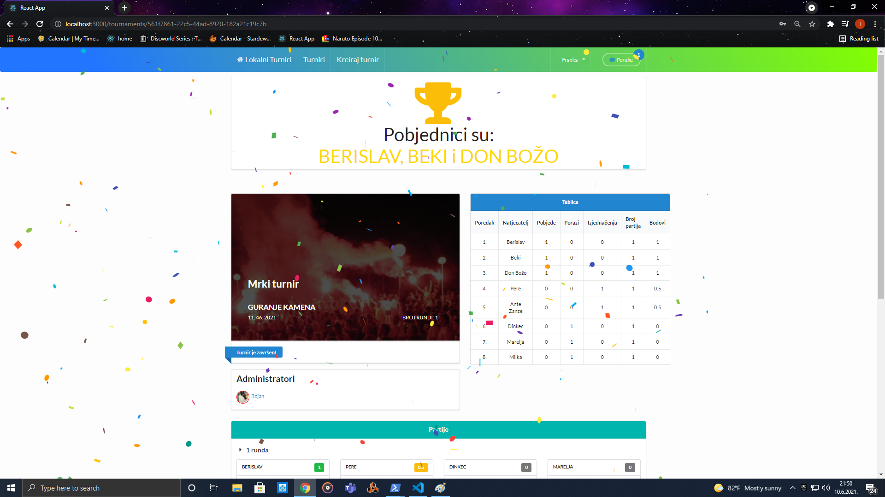
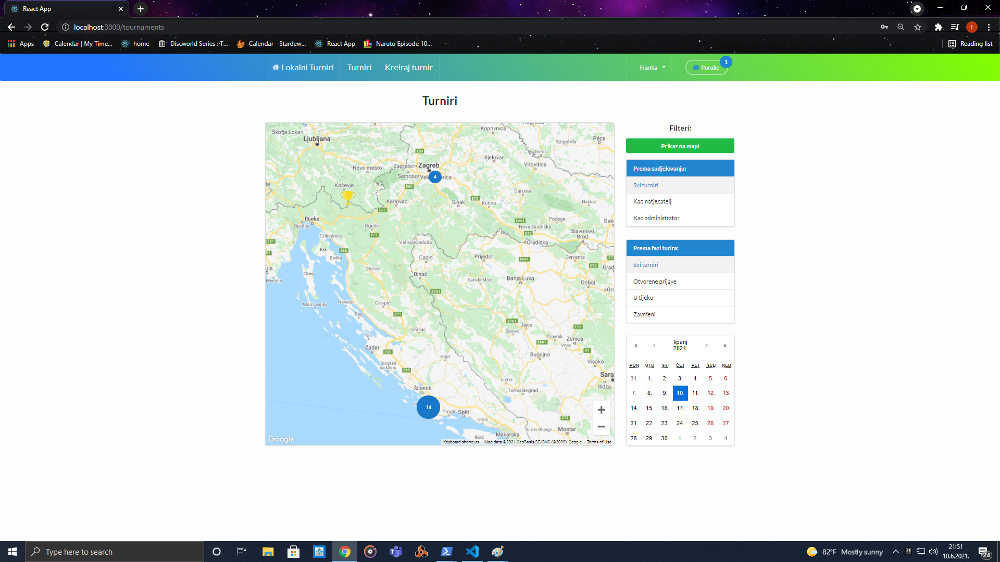

# lokalniTurniri

Web page for calculating pairs in swiss tournament style

## Images






## Description

lokalniTurniri.com is a web page where user can host a local tournament.
After other users apply server is able to calculate pairs in swiss tournament style. It automaticly calculate points for wins or loses,
Application contains messaging system in whatsApp style.
Project is still in development

## Built with

This is a fullstack project developed using:

* dotnet 5.0

* postgresql

* reactJs


## Prerequisites
* installend npm
* installed dotnet 5.0 [dotnet download](https://dotnet.microsoft.com/download/dotnet/5.0)
* installed docker for running postgresql [docker download](https://www.docker.com/products/docker-desktop)
* google-maps-api-key [get google maps api key](https://developers.google.com/maps/documentation/javascript/get-api-key)
* cloudinary credentials [cloudinaty.com](https://cloudinary.com/)

## Env varialbles
in lokalniTurniri/client create .env file and add env variable
* REACT_APP_GOOGLE_API=yourGoogleMapApiKey

in lokalniTurniri/API/ create appSettings.json file wich must contain code:

```
{
  "Logging": {
    "LogLevel": {
      "Default": "Information",
      "Microsoft": "Warning",
      "Microsoft.Hosting.Lifetime": "Information"
    }
  },
  "AllowedHosts": "*",
  "ConnectionStrings":{
    "DefaultConnection": "User ID=admin;Password=secret;Host=localhost;Port=5432;Database=lokalniTurniri;"
  },
  "JwtTokenSecret": "Your secret - can be any value",
  "Cloudinary": {
    "CloudName": "yourCloudinaryName",
    "ApiKey": "yourCloudinaryKey",
    "ApiSecret": "yourCloudinaryApiSecret"
  }

}
```

## Installation

* clone git repo
```
git clone https://github.com/rustifan/lokalniTurniri.git
```
* start postgresSql databese using docker
```
docker run --name postgresql-container -p 5432:5432 -e POSTGRES_PASSWORD=secret -e POSTGRES_USER=admin  -d postgres
```

* cd into project/API folder and run dotnet restore, and then run server
```
cd ./lokalniTurniri/API/
dotnet restore
dotnet watch run
```

* in new console cd into client folder, run npm install and then npm start
```
cd ./lokalniTurniri/client/
npm install
npm start
```

